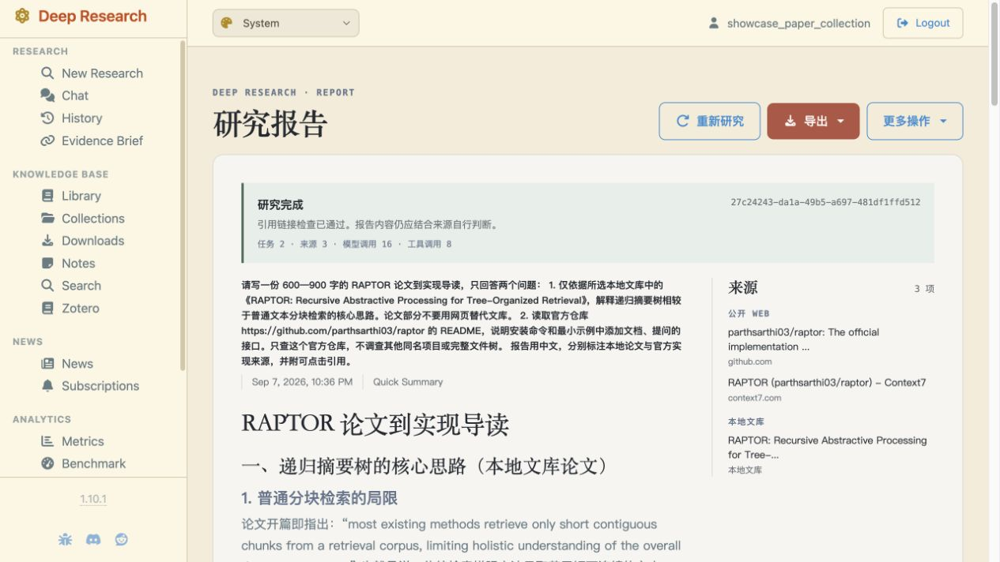

# Hybrid 网页演示记录 · 2026-09-07

此次演示从独立发布仓库的真实网页提交，使用已有公开论文文库的隔离副本。托管路线为 DeepSeek，本地路线为双卡 4-bit Qwen 27B、thinking disabled。演示不是独立评测，不合并进 12 题或 30 题成绩。

## 展示问题

请写一份 600—900 字的 RAPTOR 论文到实现导读，只回答两个问题：

1. 仅依据所选本地文库中的《RAPTOR: Recursive Abstractive Processing for Tree-Organized Retrieval》，解释递归摘要树相较于普通文本分块检索的核心思路。论文部分不要用网页替代文库。
2. 读取官方仓库 https://github.com/parthsarthi03/raptor 的 README，说明安装命令和最小示例中添加文档、提问的接口。只查这个官方仓库，不调查其他同名项目或完整文件树。

报告用中文，分别标注本地论文与官方实现来源，并附可点击引用。

## 本次接线与修复

- `d36ef55`：准确模型名显式映射到 Qwen 专用证据流程；共用网页来源、报告与历史入口。修正重新研究的旧地址和进度页问题显示。
- `6db15e1`：模型将已读文库链接误写为 `https://library/...` 时，按本次已读文档恢复为原始相对链接。未读取的文档不参与修复。

## 过程记录

| 运行 ID | 路线与问题 | 结果 |
| --- | --- | --- |
| `33fa8d65-fbeb-4634-a0cc-0443ffacfbff` | DeepSeek，较宽的 RAPTOR 机制与实现题 | 模型连接失败，未进入检索 |
| `6e33da65-72f0-4509-9867-4d4dc4648ee6` | DeepSeek，同题网络恢复重试 | 生成报告；33 次模型、23 次工具调用，320.665 秒；包含未读取的文件链接，未选为主展示 |
| `4bb30f2c-1013-4712-a1cc-6421a9eef824` | Qwen，同一较宽题目 | 真实引用文库与 GitHub；5 次模型、18 次工具调用，419.154 秒；引用检查通过，但最小示例需求未闭合，保留 incomplete |
| `91f19b28-2b68-4860-a59b-c1bd354f6212` | DeepSeek，上述收束题 | 13 次模型、5 次工具调用，38.847 秒；两种来源均已读取，发现文库链接被误加协议；原件保留，修复后的离线引用解析通过 |
| `27c24243-da1a-49b5-a697-481df1ffd512` | DeepSeek，引用修复后同题全流程 | complete；16 次模型、8 次工具调用，50.132 秒；3 个已读来源，正文引用本地论文与官方 GitHub，引用检查通过 |
| `b137cefa-2c7d-4a31-ad5d-d479b4bb1747` | Qwen，上述收束题 | incomplete；4 次模型、8 次工具调用，281.126 秒；双来源报告与引用检查通过，论文机制需求未闭合 |

原始报告、来源快照和运行轨迹保存在忽略的本地演示目录，不提交用户数据库、凭据、模型路径或论文全文。最终展示采用后续真实运行，并单列验证状态；不覆盖以上记录。

## 交付判断

DeepSeek 的网页提交、研究执行、报告呈现、本地文库引用目标及历史列表重新打开已验证。官方仓库正文已被研究连接器实际获取；独立浏览器打开 GitHub 时超时，未将其记为额外通过的点击验证。Qwen 网页已经实际进入 `qwen_multipassage_synthesis`，不再只是把托管流程换成本地模型，但这次未获得完整完成的演示结果。

`complete` 与引用检查不是事实正确率：人工阅读发现 DeepSeek 报告把树遍历写成“从叶节点层开始”，以及将单篇 story 的 QuALITY 数字省略了适用范围。正式展示全文仍应修订并标记人工编辑，原始运行不变；此次可用于展示双来源链路，不作为全报告质量满分的证据。下一项内容工作应针对这类机制方向和数值范围，而不是继续随机换题跑分。

DeepSeek 本次所有尝试合计记录输入 441,534、输出 46,302 token；最终运行其中输入 79,961、输出 7,877 token。未取得缓存计费拆分，不据此宣称实际人民币金额。Qwen 两次记录输入 38,540、输出 3,113 token，不产生托管模型 API 费用；搜索服务与已有硬件资源另计。
